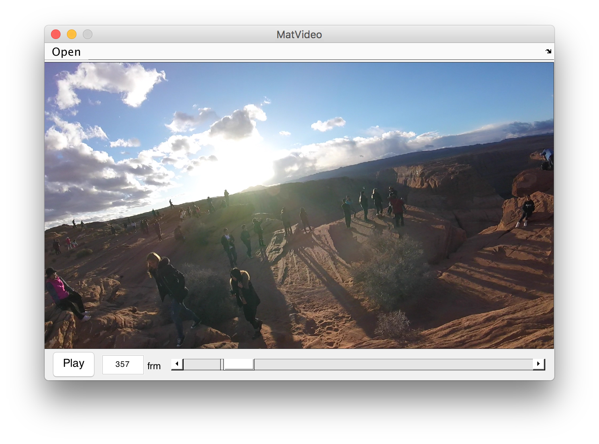

# MatVideo

### Overview
**MatVideo** is a minimal implementation of video player with MATLAB, which contains the following functions. 

* Load video
* Play video
* Pause video
* UI controls
	* Jumping to specific frame (using editbox or slider)
	* Frame skips with cursor keys

### Requirements
* MATLAB

### Developer Environment
This code is tested on OSX and MATLAB 2015b. If you're using other environment, GUI layouts might be collapsed.

### License
MIT License.
